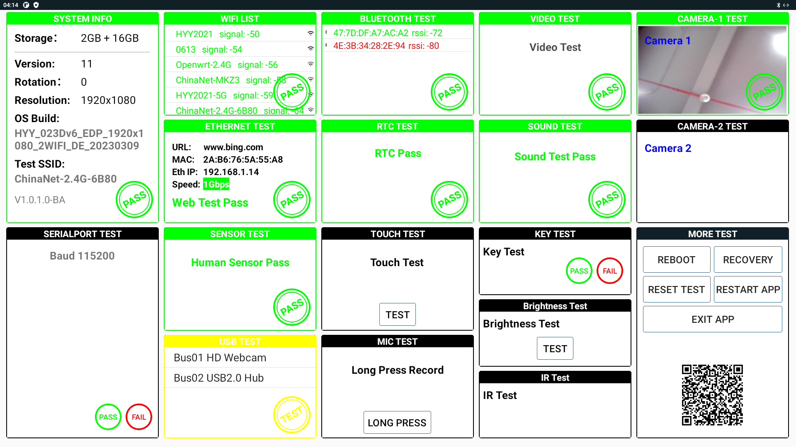
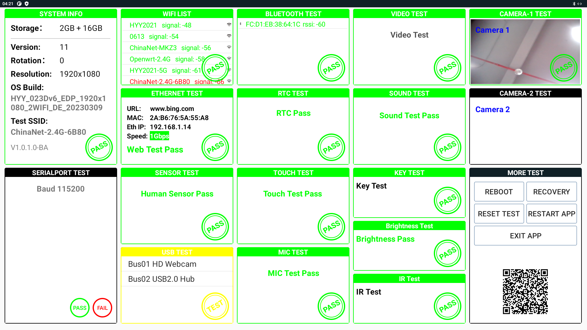
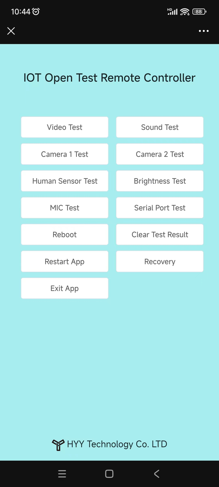

# Adroid IotOpenTest App

## Adroid IotOpenTest App Pictures Show
- Adroid IotOpenTest HomeView

- Adroid IotOpenTest TestView

- Adroid IotOpenTest TestView

- Adroid IotOpenTest Remote TestView

## IotOpenTest TestList:
- System Info Show
- Wifi Auto Test(Wifi List Show/Wifi Signal Strength Show)
- BlueTooth Auto Test(BlueTooth List Show/BlueTooth Signal Strength Show)
- Ethernet Auto Test(Ethernet Info Show)
- RTC Auto Test
- Video aging Auto Test
- Sound Auto Test
- Camera Auto Test
- Serial Port Auto Test(UART/RS232/RS485)
- Motion Sensor Auto Test
- Body Sensor Auto Test
- USB Port Auto Test(USB2.0/USB3.0)
- Touch Auto Test
- Mic Auto Test
- Key Auto Test
- Brightness Auto Test
- IR Auto Test
- Reboot Support
- Recovery Support
- Reset Support
- Rstart Support

## IotOpenTest Advenced features:
- Upload test record to Cloud
- Export test date from Cloud
- Test with any Phone
- Manager Devices
- TestApp auto upgrade

## IotOpenTest Supported CPU List:
- RockChip RK3588
- RockChip RK3568
- RockChip RK3399
- RockChip RK3566
- RockChip RK3288
- Amlogic S905X4

# Contacts

- Website: www.we-signage.com
- https://we-signage.en.made-in-china.com/
- E-mail: dennis@we-signage.com
- MP/Whatsapp/Wechat: + 86 13349909990
- Skype: solled686